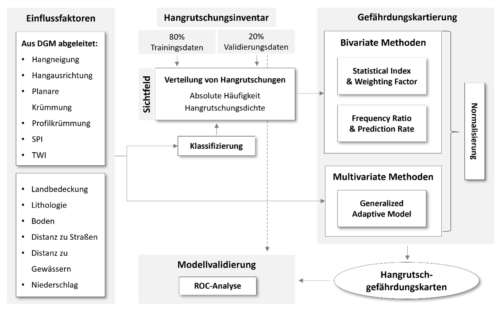

# Hangrutschungen in Zentralvietnam
Abschlussaufgabe Geo403 (Geoinformatikprojekt)
 WiSe 2024/25 bei Dr. Markus Meinhardt
 Gruppe: Julia Kroner, Tom Spinke, Marlene Westecker 

## Hintergrund 
Hangrutschungen zählen zu den gravierendsten Formen von Naturgefahren und stellen insbesondere in topographisch komplexen, intensiv genutzten sowie klimatisch sensib-len Regionen eine erhebliche Bedrohung dar. Zentralvietnam, das unter dem Einfluss des südostasiatischen Monsuns steht, ist aufgrund der Überlagerung natürlicher und anthropogener Risikofaktoren besonders anfällig für Hanginstabilitäten. Der fortschreitende Klimawandel, der eine Zunahme extremer Niederschlagsereignisse erwarten lässt, sowie die Ausweitung von Siedlungs- und Infrastrukturflächen und Eingriffe in natürliche Wasserressourcen, beispielsweise durch den Ausbau der Wasserkraft, erhöhen die Belastung der Landschaft signifikant (Das et al., 2024; Fink et al., 2017; Meinhardt et al., 2015; Nguyen et al., 2024; Razavizadeh et al., 2017).
 Eine präzise Bewertung der Hangrutschungsanfälligkeit ist essenziell, um effektive Maßnahmen des Risikomanagements zu entwickeln und fundierte politische sowie planerische Entscheidungen zu unterstützen (Crozier, 2010). In der Praxis haben sich verschiedene statistische Methoden zur Modellierung von Rutschungsgefährdungen bewährt. Besonders hervorzuheben ist der Statistische Index (SI), der durch seine einfache Anwendung und geringe Datenanforderungen überzeugt. Auf dieser Grundlage wurde die Weighting Factor (WF)-Methode entwickelt, die eine differenzierte Berücksichtigung des Einflusses einzelner Prädiktoren ermöglicht (Çevik & Topal, 2003; Meinhardt et al., 2015).
 Das Ziel dieser Arbeit besteht darin, die Hangrutschungsanfälligkeit im Untersuchungsgebiet mithilfe der WF-basierten SI-Methode zu kartieren. Die Resultate sollen als Grundlage für ein nachhaltiges Risikomanagement in besonders gefährdeten Regionen dienen. Dieses Repository enhält Beispieldaten sowie kommentierte Python-Skipte, um eine Gefährdungskarte abzuleiten.

## Workflow

## Datenbeschreibung
Für die Erstellung einer Hangrutschungsgefährdungskarte können verschiedene Parameter berücksichtigt werden. Für einen reibungslosen Ablauf sollten die Daten als Raster mit maximal 5-10 Klassen vorliegen, sowie die gleiche Ausdehnung und Auflösung haben. Folgende **Parameter** bieten sich für die Analyse von Hangrutschungsgefährdung an: 
- DGM Derivate:
  - Hangneigung
  - Hangausrichtung
  - Planare Krümmung
  - Profilkrümmung
  - SPI
  - TWI 
- Landbedeckung
- Lithologie
- Boden
- Distanz zu Straßen
- Distanz zu Gewässern
- Niederschlag 
 Darüber hinaus werden ein **Hangrutschungsinventar** sowie ggf. eine **Sichtfeldmaske** benötigt. Daten, die zum Testen der Skripte genutzt werden können befinden sich im Order "Beispieldaten".

## Literatur
- Çevik, E., & Topal, T. (2003). GIS-based landslide susceptibility mapping for a problematic segment of the natural gas pipeline, Hendek (Turkey). Environmental Geology, 44(8), 949–962. https://doi.org/10.1007/s00254-003-0838-6
- Crozier, M. J. (2010). Deciphering the effect of climate change on landslide activity: A review. Geomorphology, 124(3–4), 260–267. https://doi.org/10.1016/j.geomorph.2010.04.009
- Das, R., Tien, P. V., Wegmann, K. W., & Chakraborty, M. (2024). Machine learning-based assessment of regional-scale variation of landslide susceptibility in central Vietnam. PLOS ONE, 19(10), e0308494. https://doi.org/10.1371/journal.pone.0308494
- Fink, M., Fischer, C., Laux, P., Tünschel, H., & Meinhardt, M. (2017). Distributed Assessment of Sediment Dynamics in Central Vietnam. In A. Nauditt & L. Ribbe (Hrsg.), Land Use and Climate Change Interactions in Central Vietnam: LUCCi (S. 189–200). Springer. https://doi.org/10.1007/978-981-10-2624-9_12
- Meinhardt, M., Fink, M., & Tünschel, H. (2015). Landslide susceptibility analysis in central Vietnam based on an incomplete landslide inventory: Comparison of a new method to calculate weighting factors by means of bivariate statistics. Geomorphology, 234, 80–97. https://doi.org/10.1016/j.geomorph.2014.12.042
- Nguyen, H. D., Dang, D. K., Nguyen, Q.-H., Phan-Van, T., Bui, Q.-T., Petrisor, A.-I., & Nghiem, S. V. (2024). Monitoring the effects of climate, land cover and land use changes on multi-hazards in the Gianh River watershed, Vietnam. Environmental Research Letters, 19(10), 104033. https://doi.org/10.1088/1748-9326/ad7278
- Razavizadeh, S., Solaimani, K., Massironi, M., & Kavian, A. (2017). Mapping landslide susceptibility with frequency ratio, statistical index, and weights of evidence models: A case study in northern Iran. Environmental Earth Sciences, 76(14), 499. https://doi.org/10.1007/s12665-017-6839-7

